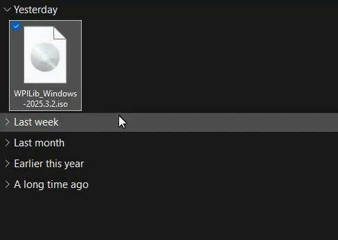

import IconExternalLink from '@theme/Icon/ExternalLink';

# WPILib Setup
WPILib is a software library used by all FRC teams. It provides an API for interacting with the robot’s hardware and control system, including motor controllers, sensors, the Driver Station, the SmartDashboard, and more.
[Learn more<IconExternalLink />](https://docs.wpilib.org/en/stable/docs/software/what-is-wpilib.html)

:::tip
Refer to [FRC WPILib Instruction](https://docs.wpilib.org/en/stable/docs/zero-to-robot/step-2/wpilib-setup.html) for more details.
:::

:::note System Requirements
- **Operating System:** Windows 10 or Windows 11  
- **Architecture:** x86 (64-bit). *ARM-based devices are not supported*

*For FRC only*
:::

## Step 1: Download
1. Navigate to WPILib's Github [releases page<IconExternalLink />](https://github.com/wpilibsuite/allwpilib/releases)
2. Find the latest version of WPILib release
3. Scroll down to Assets, then select the software that corresponds your Operation System (OS)

## Step 2: Installation
### Extraction
1. Locate your downloaded `.iso` file in your File Explorer
2. Right click and select `Mount`

:::note
If you do not have `Mount` option, use [7-Zip](https://www.7-zip.org/) and extract the file through it. Then follow from the 3rd step.
:::

### Installation
Once you have extracted the contents of the `.iso` file:

1. Double click `WPILibInstaller.exe`
2. Run through the installer prompts:
   - Choose `Everything`
   - Choose `Install for this User` or `Install for all Users`
     - `Install for this User`: Installs WPILib to your current signed-in account only
     - `Install for all Users`: Installs WPILib for all users on your computer

### VSCode Install Prompt
When the installer prompts you to download the WPILib's own VSCode version, make sure you do download them.

:::tip
Recommended option: `Downalod for this Computer only`.
:::

## Step 3: Finish :tada:
Once WPILib is done installing, click `Finish`. You have finished downloading WPILib on to your computer! 🎉